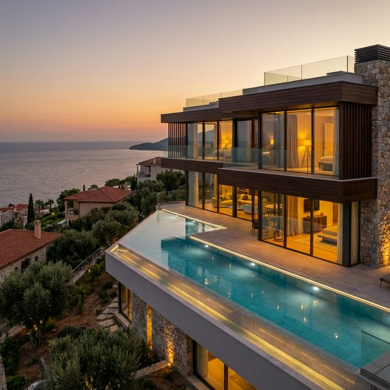
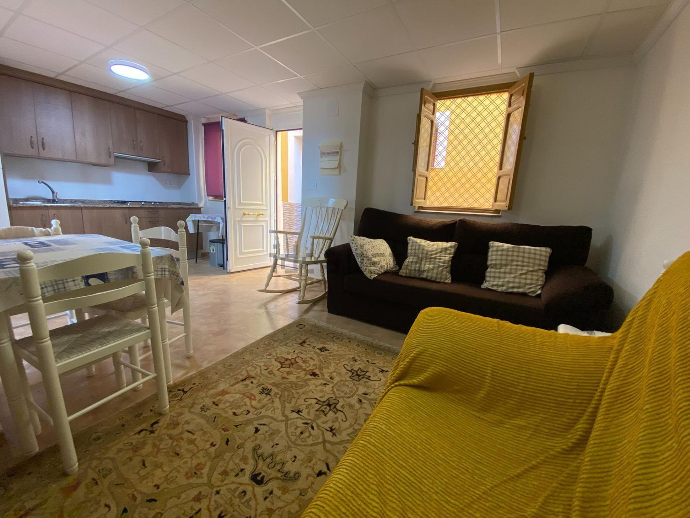

# Walkthrough: Casa Los Manicos Project

He completado el proyecto para la página web de tu alojamiento turístico. Aquí tienes un resumen de lo que hemos construido y cómo ponerlo en marcha.

## 1. Estructura del Proyecto
- `scripts/setup_vps.sh`: Script para configurar tu servidor Ubuntu con Nginx de forma ligera y segura.
- `public/`: Directorio raíz de la web.
    - `index.html`: Estructura principal moderna y responsiva.
    - `css/styles.css`: Diseño premium con efectos de vidrio (glassmorphism) y tipografía cuidada.
    - `js/config.js`: **Aquí es donde puedes cambiar los textos e imágenes fácilmente.**
    - `assets/`: Carpeta con las fotos (he generado unas fotos de ejemplo espectaculares).

## 2. Inicialización del VPS
Para configurar tu VPS, sigue estos pasos:
1. Sube el archivo [setup_vps.sh](scripts/setup_vps.sh) a tu servidor.
2. Exporta tu token: `export GITHUB_TOKEN='tu_token'`.
3. Ejecuta: `bash scripts/setup_vps.sh`.
4. El script creará el usuario **juanri**, configurará Git para sincronizar el repo mediante el token y creará un **enlace simbólico** de la web. De esta forma, cada vez que hagas un `git pull` en el servidor, la web se actualizará automáticamente.

## 3. Personalización Fácil
No necesitas editar el código HTML para cambiar lo básico. Abre [config.js](public/js/config.js) y verás una estructura como esta:

```javascript
const CONFIG = {
    title: "Casa Los Manicos",
    tagline: "Tu Refugio Privado",
    contact: {
        address: "Calle Principal 123...",
        // ...
    }
};
```
Simplemente cambia los valores entre comillas y guarda el archivo.

## 4. Diseño Visual
La web incluye:
- **Efecto Glassmorphism**: La cabecera se vuelve translúcida al hacer scroll.
- **Diseño Mobile-First**: Se ve perfecto en móviles y tablets.
- **Imágenes de Alta Calidad**: He incluido placeholders realistas basados en tu descripción.


*Vista previa del diseño Hero*


*Vista previa de los interiores*

### 📹 Demostración Visual
He generado una grabación de la navegación por la página y capturas de las diferentes secciones para que puedas ver el resultado final:


*Grabación de la navegación por el sitio*

````carousel

<!-- slide -->

````

## 5. Caruseles de Imágenes
Hemos implementado carruseles dinámicos en la sección "Nuestra Propuesta".
- **Interacción**: Los carruseles cambian de imagen automáticamente cada 5-7 segundos para dar dinamismo a la web.
- **Control Manual**: El usuario puede usar las flechas laterales o los puntos indicadores para navegar por las fotos.
- **Personalización**: Las imágenes se configuran fácilmente desde [config.js](public/js/config.js).

### Vista Previa de los Carruseles
A continuación puedes ver cómo han quedado integrados los carruseles en la web:


### Video de Navegación por Carruseles
En este video se observa el funcionamiento de los controles y las transiciones suaves entre imágenes:


## 6. SSL y Seguridad Automática
El despliegue incluye seguridad completa desde el primer momento:
- **HTTPS Automático**: El script utiliza Certbot para obtener un certificado de Let's Encrypt sin intervención manual (siempre que el dominio ya esté apuntando al servidor).
- **Redirección Forzada**: Toda visita a `http://` será redirigida automáticamente a `https://` para proteger a tus usuarios.
- **Mantenimiento Cero**: Se incluye una tarea programada que renueva el certificado antes de que caduque.

## 7. Próximos Pasos
1. **Sincronización**: Realiza un `git pull` en tu VPS para recibir estos cambios. como el directorio público es un enlace simbólico, la web se actualizará al instante.
2. **Imágenes Reales**: Sustituye los placeholders en `public/assets/` con tus fotos definitivas manteniendo los nombres de archivo (`interior_2.png`, etc.) o actualiza las rutas en `config.js`.
3. Sube el contenido de la carpeta `public/` a `/var/www/casalosmanicos.com` en tu VPS.
4. Asegúrate de que tu dominio apunta a la IP del VPS.
5. Ejecuta el script de configuración y ¡disfruta de tu nueva web segura!
